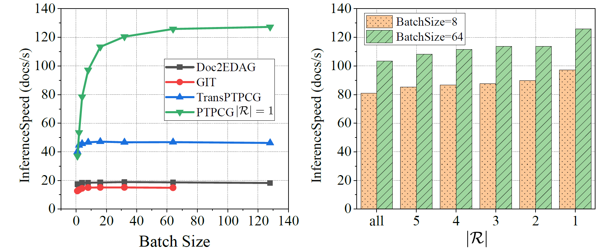

# ❤️ A Toolkit for Document-level Event Extraction with & without Triggers

[](https://github.com/Spico197/DocEE/actions/workflows/build.yml)
[](https://codecov.io/gh/Spico197/DocEE)
[](https://doc-ee.readthedocs.io/en/latest/?badge=latest)

<!-- [⚙️Installation](#️installation) | [🚀Quick Start](#quick-start) | [💾Data Preprocessing](#data-preprocessing) | [📋Reproduction](#reproduction)| [⚽Find Pseudo Triggers](#find-pseudo-triggers) | [📚Instructions](#instructions) | [🙋FAQ](#faq) | [📜Citation](#citation) | [🔑Licence](#licence) | [🤘Furthermore](#furthermore) -->

Hi, there 👋. Thanks for your stay in this repo.

This project aims at building a universal toolkit for extracting events automatically from documents 📄 (long texts).
The details can be found in our IJCAI'22 paper: [Efficient Document-level Event Extraction via Pseudo-Trigger-aware Pruned Complete Graph](https://www.ijcai.org/proceedings/2022/632)

🔥 We have an online demo [[here]](http://hlt.suda.edu.cn/docee) (available in 9:00-17:00 UTC+8).

Currently, this repo contains `PTPCG`, `Doc2EDAG` and `GIT` models, and these models are all designed for document-level event extraction without triggers.
Here are some basic descriptions to help you understand the characteristics of each model:

- [**PTPCG**](https://www.ijcai.org/proceedings/2022/632) is a fast and lightweight model which takes only 3.6% GPU training resources than GIT, and it is 8.5x faster when inference. Besides, PTPCG is better than GIT and Doc2EDAG on o2o (one instance per doc) docs. Overall metrics scores are higher than Doc2EDAG and competitive to GIT. We tested this model on the [LIC'21](https://aistudio.baidu.com/aistudio/competition/detail/65/0/leaderboard) information extraction shared task and won top5 prize 🏆 (team: 广告位招租). Availability are confirmed. Supplements are included [here](PTPCG-supplements.pdf) (including detailed examples, the BK algorithm, hyperparameters and additional experiment results).

- [**GIT**](https://arxiv.org/abs/2105.14924) is the SOTA model (Doc2EDAG modification), which shows the great power on o2m (multi instances with the same event type per doc) and m2m (multi instances with multi event types per doc) docs. GIT is slower than Doc2EDAG and need more resources to train and inference.
- [**Doc2EDAG**](https://arxiv.org/abs/1904.07535) is an auto-regressive model with good compatibilities on DocEE without triggers and is a widely used baseline for DocEE. This repo is developed based on [Doc2EDAG](https://github.com/dolphin-zs/Doc2EDAG).

## ⚙️Installation

Make sure you have the following dependencies installed.

- Python 3.7.7
  - torch==1.5.1  # should be OK with higher torch version
  - pytorch-mcrf==0.0.3 # for MaskedCRF
  - gpu-watchmen==0.3.8 # if you wanna wait for a vacant GPU via `gpu-watchmen`
  - loguru==0.5.3
  - matplotlib==3.3.0
  - numpy==1.19.0
  - transformers==4.9.1
  - dgl-cu92==0.6.1  # find a version that is compatable with your CUDA version
  - tqdm==4.53.0
  - networkx==2.4
  - tensorboard==2.4.1

```bash
# don't forget to install the dee package
$ git clone https://github.com/Spico197/DocEE.git
$ pip install -e .
# or install directly from git
$ pip install git+https://github.com/Spico197/DocEE.git
```

## 🚀Quick Start

### 💾Data Preprocessing

```bash
# ChFinAnn
## You can download Data.zip from the original repo: https://github.com/dolphin-zs/Doc2EDAG
$ unzip Data.zip
$ cd Data
# generate data with doc type (o2o, o2m, m2m) for better evaluation
$ python stat.py

# DuEE-fin
## If you want to win the test, you should check the codes and make further modifications,
## since each role may refer to multiple entities in DuEE-fin.
## Our PTPCG can help with this situation, all you need is to check the data preprocessing
## and check `predict_span_role()` method in `event_table.py`.
## We **do not** perform such magic tricks in the paper to make fair comparisons with Doc2EDAG and GIT.
$ # downloading datasets from https://aistudio.baidu.com/aistudio/competition/detail/65
$ cd Data/DuEEData  # paste train.json and dev.json into Data/DuEEData folder and run:
$ python build_data.py
```

### 📋To Reproduce Results in Paper

[Doc2EDAG](https://arxiv.org/abs/1904.07535) and [GIT](https://github.com/RunxinXu/GIT) are already integrated in this repo, and more models are planned to be added.

If you want to reproduce the [PTPCG](https://www.ijcai.org/proceedings/2022/632) results, or run other trials, please follow the instructions below.

Before running any bash script, please ensure `bert_model` has been correctly set.

- [Doc2EDAG](https://github.com/dolphin-zs/Doc2EDAG)

**Tip:** At least 4 * NVIDIA V100 GPU (at least 16GB) cards are required to run Doc2EDAG models.

```bash
# run on ChFinAnn dataset
$ nohup bash scripts/run_doc2edag.sh 1>Logs/Doc2EDAG_reproduction.log 2>&1 &
$ tail -f Logs/Doc2EDAG_reproduction.log

# run on DuEE-fin dataset without trigger
$ nohup bash scripts/run_doc2edag_dueefin.sh.sh 1>Logs/Doc2EDAG_DuEE_fin.log 2>&1 &
$ tail -f Logs/Doc2EDAG_DuEE_fin.log

# run on DuEE-fin dataset with trigger
$ nohup bash scripts/run_doc2edag_dueefin_withtgg.sh 1>Logs/Doc2EDAG_DuEE_fin_with_trigger.log 2>&1 &
$ tail -f Logs/Doc2EDAG_DuEE_fin_with_trigger.log
```

- [GIT](https://github.com/RunxinXu/GIT)

**Tip:** At least 4 * NVIDIA V100 GPU (32GB) cards are required to run GIT models.

```bash
# run on ChFinAnn dataset
$ nohup bash scripts/run_git.sh 1>Logs/GIT_reproduction.log 2>&1 &
$ tail -f Logs/GIT_reproduction.log

# run on DuEE-fin dataset without trigger
$ nohup bash scripts/run_git_dueefin.sh 1>Logs/GIT_DuEE_fin.log 2>&1 &
$ tail -f Logs/GIT_DuEE_fin.log

# run on DuEE-fin dataset with trigger
$ nohup bash scripts/run_git_dueefin_withtgg.sh 1>Logs/GIT_DuEE_fin_with_trigger.log 2>&1 &
$ tail -f Logs/GIT_DuEE_fin_with_trigger.log
```

- [PTPCG](https://www.ijcai.org/proceedings/2022/632)

**Tip:** At least 1 * 1080Ti (at least 9GB) card is required to run PTPCG.

Default: |R| = 1, which means only the first (pseudo) trigger is selected.

```bash
# run on ChFinAnn dataset (to reproduce |R|=1 results in Table 1 of the PTPCG paper)
$ nohup bash scripts/run_ptpcg.sh 1>Logs/PTPCG_R1_reproduction.log 2>&1 &
$ tail -f Logs/PTPCG_R1_reproduction.log

# run on DuEE-fin dataset without annotated trigger (to reproduce |R|=1, Tgg=× results in Table 3 of the PTPCG paper)
$ nohup bash scripts/run_ptpcg_dueefin.sh 1>Logs/PTPCG_P1-DuEE_fin.log 2>&1 &
$ tail -f Logs/PTPCG_P1-DuEE_fin.log

# run on DuEE-fin dataset with annotated trigger and without pseudo trigger (to reproduce |R|=0, Tgg=√ results in Table 3 of the PTPCG paper)
$ nohup bash scripts/run_ptpcg_dueefin_withtgg.sh 1>Logs/PTPCG_T1-DuEE_fin.log 2>&1 &
$ tail -f Logs/PTPCG_T1-DuEE_fin.log

# run on DuEE-fin dataset with annotated trigger and one pseudo trigger (to reproduce |R|=1, Tgg=√ results in Table 3 of the PTPCG paper)
$ nohup bash scripts/run_ptpcg_dueefin_withtgg_withptgg.sh 1>Logs/PTPCG_P1T1-DuEE_fin.log 2>&1 &
$ tail -f Logs/PTPCG_P1T1-DuEE_fin.log
```

| #PseudoTgg | Setting |  Log  | Task Dump |
| ---------: | :-----: | :---: | :-------: |
|          1 |[189Cloud](https://cloud.189.cn/web/share?code=riQ7ji7fEzmm)|[189Cloud](https://cloud.189.cn/web/share?code=VvYn2mBzI7Vr) | [189Cloud](https://cloud.189.cn/web/share?code=fUZrMje2ii2y) |

Explainations on PTPCG hyperparameters in the executable script:

```python
# whether to use max clique decoding strategy, brute-force if set to False
max_clique_decode = True
# number of triggers when training, to make all arguments as pseudo triggers, set to higher numbers like `10`
num_triggers = 1
# number of triggers when evaluating, set to `-1` to make all arguments as pseudo triggers
eval_num_triggers = 1
# put additional pseudo triggers into the graph, make full use of the pseudo triggers
with_left_trigger = True
# make the trigger graph to be directed
directed_trigger_graph = True
# run mode is used in `dee/tasks/dee_task.py/DEETaskSetting`
run_mode = 'full'
# at least one combination (see paper for more information)
at_least_one_comb = True
# whether to include regex matched entities
include_complementary_ents = True
# event schemas, check `dee/event_types` for all support schemas
event_type_template = 'zheng2019_trigger_graph'
```

### ⚽Find Pseudo Triggers

Please check `Data/trigger.py` for more details.
In general, you should first convert your data into acceptable format (like `typed_train.json` after building ChFinAnn).

Then, you can run the command below to generate event schemas with pseudo triggers and importance scores:

```bash
$ cd Data
$ python trigger.py <max number of pseudo triggers>
```

## 📚Instructions

- `dee` has evoluted to a toolkit package, make sure to install the package first: `pip install -e .`
- Please change the path to BERT to load the tokenizer.
- To run on ChFinAnn dataset, you should generate `typed_(train|dev|test).json` files first via `cd Data && python stat.py` after `Data.zip` file unzipped into the `Data` folder.
- It's not DDP model by default. If you want to train across different devices, add a `--parallel_decorate` flag after `python run_dee_task.py`.
- Comments starting with `tzhu` are added by Tong Zhu to help understanding the codes, not written in the original Doc2EDAG repo.
- For trials on DuEE-fin dataset, if you want to submit generated files to online platform, check the `dueefin_post_process.py` to make further post process to meet the format requirments.
- I had tried lots of wasted models, so there were redundancies. For better understanding the codes and get rid of any potential distractions, I delete them from this repo. There may be some other redundancies and you may find there are unused methods or models, feel free to touch me and make the repo cleaner and nicer together~ Btw, there may be some issues if some files are removed directly. Feel free to reach me by openning an issue or email. I check the GitHub site messages everyday regularly and emails are received instantly during weekdays.

## 🙋FAQ

- Q: What's the evluation strategy to calculate the final micro-F1 scores?
  - A: Micro-F1 scores are calculated by counting the final number of event role predictions' TP , FP and FNs
- Q: What is `teacher_prob` doing ?
  - A: It's used in the scheduled sampling strategy, indicating the probability to use the `gold_span`. If `teacher_prob == 0.7`, then there is 70% probability to use `gold_span` during training. `teacher_prob` will decrease during training.
- Q: What's GreedyDec?
  - A: Greedy decoding is a prediction generation strategy. We can fill in the event table by finding the first corresponding entity for each field (argument role). That's why it's called a `Greedy` method.
- Q: How to make predictions and get readable results with a trained model?
  - A: Such inference interface is provided in `dee/tasks/dee_task.py/DEETask.predict_one()` (**Convenient online serving interface**).
  - A: Such inference usage is provided in `inference.py`. Change settings in line 8,9,12 and run `CUDA_VISIBLE_DEVICES="<cuda device, could be empty to use cpu>" python inference.py` to quickly start.
- Q: What is `o2o`, `o2m` and `m2m`?
  - A: They are abbreviations for `one-type one-instance per doc`, `one-type with multiple instances per doc` and `multiple types per doc`.
- Q: I see lots of terms in `Exps/<task_name>/Output/dee_eval.(dev|test).(pred|gold)_span.<model_name>.<epoch>.json`, what are those mean?
  - A: Please refer to the `Evluation` section of documents, or refer to [#7](https://github.com/Spico197/DocEE/issues/7).


## 📜Citation

This work has not been published yet, please cite the arXiv preview version first 😉

```bibtex
@inproceedings{ijcai2022p632,
  title     = {Efficient Document-level Event Extraction via Pseudo-Trigger-aware Pruned Complete Graph},
  author    = {Zhu, Tong and Qu, Xiaoye and Chen, Wenliang and Wang, Zhefeng and Huai, Baoxing and Yuan, Nicholas and Zhang, Min},
  booktitle = {Proceedings of the Thirty-First International Joint Conference on
               Artificial Intelligence, {IJCAI-22}},
  publisher = {International Joint Conferences on Artificial Intelligence Organization},
  editor    = {Lud De Raedt},
  pages     = {4552--4558},
  year      = {2022},
  month     = {7},
  note      = {Main Track},
  doi       = {10.24963/ijcai.2022/632},
  url       = {https://doi.org/10.24963/ijcai.2022/632},
}
```

## 🔑Licence

MIT Licence


## ✨UPDATES

- 2022/6/22 - v0.3.2: add WikiEvents and English support
- 2022/5/26 - v0.3.1: add more docs, change instance evaluation with event type included as mentioned in [#7](https://github.com/Spico197/DocEE/issues/7#issuecomment-1101489100).
- 2022/5/26 - v0.3.0: add `DEPPNModel` (beta), change `luge_*` templates into `dueefin_*`, add `OtherType` as default `common_fields` in `dueefin_(w|wo)_tgg` templates, add `isort` tool to help formatting
- 2021/12/16 - v0.2.2: remove `LSTMMTL2EDAGModel`, `EventTableForIndependentTypeCombination`, `DEEMultiStepTriggeringFeatureConverter` and `DEEMultiStepTriggeringFeature` which are redundant. Update test cases via `zheng2019_trigger_graph` schema. Codes are formatted by `black`.

## 🤘Furthermore

This repo is still under development.
If you find any bugs, don't hesitate to drop us an issue.

Thanks~
